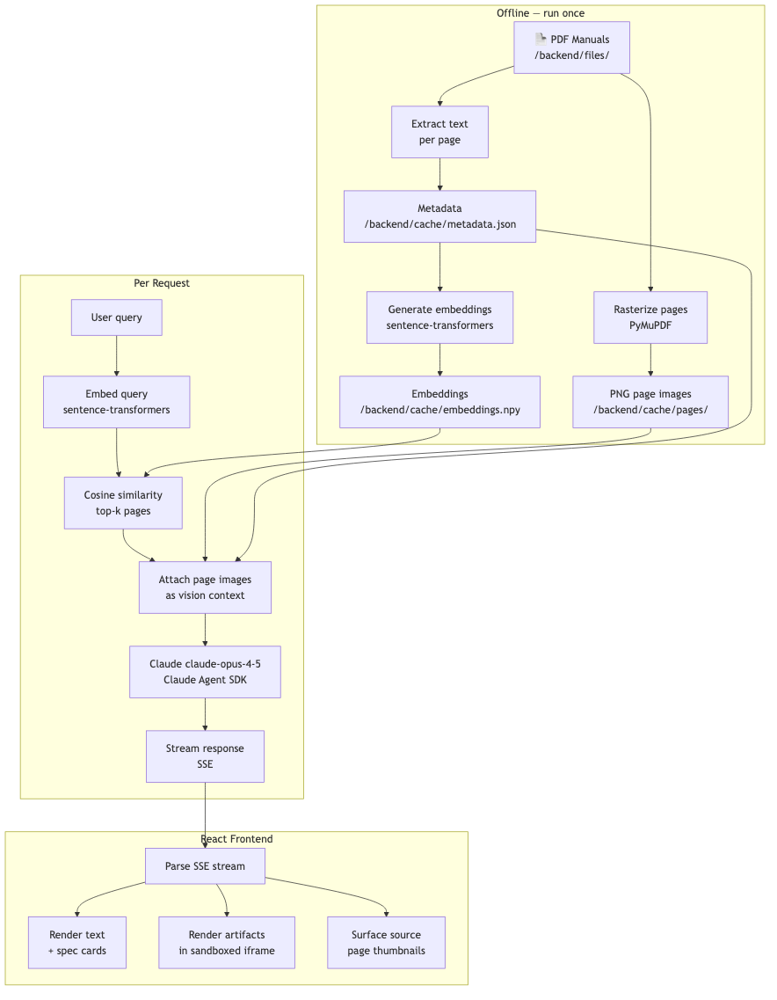

# Proxy – Vulcan OmniPro 220 AI Assistant

A multimodal AI assistant for the Vulcan OmniPro 220 welder, built on the Claude Agent SDK. Ask it anything about the machine — it answers with text, interactive diagrams, and calculators generated on the fly from manual knowledge.

**Live demo:** https://prox-challenge-eosin.vercel.app

**Video walkthrough:** https://youtu.be/YRvs1A_Xnzw


## Features

- **Deep technical accuracy** — answers questions that require cross-referencing multiple manual sections, including duty cycle matrices, polarity setups, wire feed calibration, and troubleshooting
- **Multimodal responses** — generates interactive React artifacts on the fly: wiring diagrams, duty cycle calculators, troubleshooting flowcharts, settings configurators
- **Multimodal input** — text, image uploads, and voice input (speech-to-text via ElevenLabs, available on localhost)
- **Voice output** — optional text-to-speech responses via ElevenLabs
- **Streaming** — responses stream token by token with a live artifact loading animation

## Running locally

**Requirements:** Python 3.12+, [Bun](https://bun.sh)

```bash
git clone <repo>
cd <repo>
cp .env.example .env   # add your ANTHROPIC_API_KEY
./start.sh
```

Open [http://localhost:5173](http://localhost:5173).

The start script sets up the Python virtualenv, installs dependencies for both backend and frontend, and starts both servers. `Ctrl+C` stops everything.

### Environment variables

```
ANTHROPIC_API_KEY=...         # required
ELEVENLABS_API_KEY=...        # optional — enables voice input and TTS
```

## Architecture



```
PDF manuals
   └─ pdf_processing.py
        ├─ Rasterizes every page to PNG (PyMuPDF)
        │      └─ saved to backend/cache/pages/
        ├─ Extracts text per page
        │      └─ saved to backend/cache/metadata.json
        └─ Generates sentence-transformer embeddings
               └─ saved to backend/cache/embeddings.npy

User query
   └─ FastAPI /chat endpoint
        ├─ Embeds query → cosine similarity → top-k pages
        ├─ Attaches page metadata as text context
        ├─ Attaches page images as vision context
        └─ Streams response via Claude Agent SDK (SSE)
             └─ React frontend
                  └─ Renders text responses and <antartifact> blocks as live iframes
```

### Key design decisions

**Image-first RAG.** The OmniPro 220 manual contains critical information that only exists as images — the welding process selection chart, weld diagnosis photos, wiring schematics, polarity diagrams. Text extraction alone misses all of this. Every page is rasterized and sent to Claude as a vision input alongside the extracted text, so the model reads diagrams directly rather than relying on text approximations.

**Claude Artifacts.** The agent is prompted to generate `<antartifact>` blocks containing self-contained React components. The frontend detects these, sandboxes them in iframes with injected CSS variables for light/dark theming, and renders them inline. This enables interactive outputs — calculators, flowcharts, schematic diagrams — that are far more useful than text descriptions for a physical machine setup context.

**Streaming with artifact animation.** Artifact generation takes several seconds. Rather than show nothing, the UI renders a live welding arc animation with cycling status messages while the response streams in, transitioning smoothly to the rendered artifact when complete.

## UI Design

The app was designed primarily for **mobile use**. The target user is a welder standing in a workshop, gloves on, needing a quick answer without having to navigate a complex interface. It also works well on desktop.

- **Familiar, minimalist layout** — chat interface with no learning curve. The UI is not meant to add cognitive load on top of an already technical task.
- **Process selector chips** (MIG / TIG / Stick / Flux-Core) — surface the most common entry points immediately, reducing typing friction for the most frequent use cases.
- **Light/dark theme** — workshop lighting varies. A welder in a dark garage vs. outdoors in daylight needs different contrast.
- **Animations** — used deliberately to make the experience feel cohesive and responsive. Waiting for a long LLM response with no feedback is a poor experience; the welding arc animation and streaming text make the wait feel productive.
- **Multimodal input** — users can upload photos of their machine, settings, or welds. Voice input (on localhost) is especially relevant since welders often work with gloves, making typing cumbersome.

## Limitations & Future Improvements

**Deployment performance.** The current deployment uses free-tier infrastructure for demo purposes. The sentence-transformer model loads on cold start, adding latency. A persistent worker process or pre-warmed backend would significantly improve response times in production.

**Retrieval quality.** Retrieval is currently text-embedding based — the query is matched against extracted page text. A hybrid approach combining text embeddings with visual embeddings of the rasterized page images would improve retrieval for diagram-heavy queries where the text alone doesn't capture the content.

**Voice-first interface.** Voice input is currently only available on localhost (ElevenLabs API key required). For production, voice should be the primary input method — welders working with gloves have limited typing ability, and voice has significantly higher throughput than a keyboard in a hands-busy environment.

**Session memory.** The app intentionally has no persistent chat history. The primary use case is ephemeral — a welder opens the app, asks 2-3 questions about their specific setup, gets what they need, and moves on. Persistent history adds UI complexity that doesn't serve this flow and may feel intrusive for a tool users dip in and out of. The more compelling production direction is **semantic query caching**: store the embedding and response for previously asked questions, and on a high-similarity cache hit return the cached response instantly. This gives faster and deterministic answers for common questions (duty cycle lookups, polarity setups, wire speed ranges) without any added UI complexity — and reduces API costs over time as the cache warms up.

**Multi-product support.** The architecture is not specific to the OmniPro 220 — it generalizes to any product with a manual. Multi-product support (e.g. the full Harbor Freight catalog, or any brand's tool lineup) is a natural extension requiring no architectural changes.
